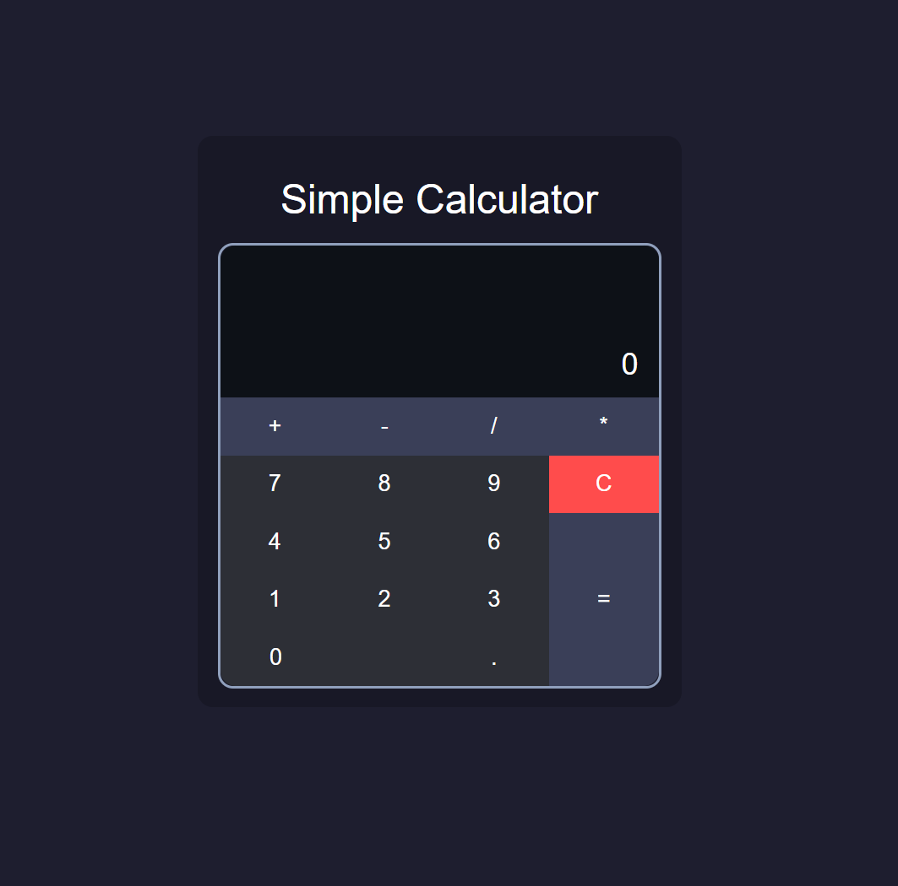

# Simple Calculator

A minimalist web-based calculator built with **HTML**, **CSS**, and **JavaScript**. It provides essential arithmetic functionality with a modern and responsive user interface.

## Features

- Basic operations: addition, subtraction, multiplication, and division
- Decimal number input support
- Clear and equals functionality
- Responsive and dark-themed UI
- Smooth button interactions

## Demo

  

## Technologies Used

- **HTML5**: Markup structure
- **CSS3**: Styling and layout
- **JavaScript (Vanilla)**: Functional logic and interactivity

## How to Use

1. **Clone the repository**:
   ```bash
   git clone https://github.com/yourusername/simple-calculator.git
   ```

2. **Open `index.html` in your browser**:
   ```bash
   cd simple-calculator
   open index.html
   ```
   *(Use a compatible method on your OS to open the file)*

3. **Use the calculator** to perform operations directly in your browser.

## File Structure

```
simple-calculator/
├── index.html        # Main HTML structure
├── style.css         # Styles and layout
├── script.js         # Calculator logic
└── screenshot.png    # Image preview
```

## Notes

- This project uses `eval()` to evaluate arithmetic expressions for simplicity. In a production environment, consider a more secure alternative.
- Ensure JavaScript is enabled in your browser for proper functionality.
